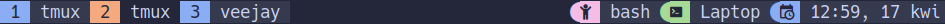
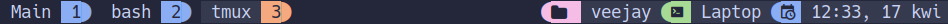
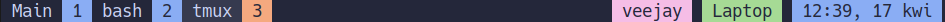

<h3 align="center">
	<br/>
	
	Catppuccin for <a href="https://github.com/tmux/tmux">Tmux</a>
	
</h3>

<p align="center">
    <a href="https://github.com/catppuccin/tmux/stargazers"></a>
    <a href="https://github.com/catppuccin/tmux/issues"></a>
    <a href="https://github.com/catppuccin/tmux/contributors"></a>
</p>

<p align="center">
  
</p>

## Content

1. [Themes](#themes)
2. [Installation](#installation)
3. [Status line themes](#status-line-themes)
   1. [Default](#default)
   2. [Pill](#pill-shape)
   3. [Powerline](#powerline)
   4. [Powerline with icons](#powerline-with-icons)
   5. [No patched fonts](#no-patched-fonts)
4. [Configuration options](#configuration-options)
   1. [Enable window tabs](#enable-window-tabs)
   2. [Configure separators](#configure-separator)
   3. [Enable date and time](#enable-datetime)
   4. [Enable user](#enable-user)
   5. [Enable host](#enable-host)
   6. [Customize icons](#customize-icons)

## Themes

- 🌻 [Latte](./catppuccin-latte.tmuxtheme)
- 🪴 [Frappé](./catppuccin-frappe.tmuxtheme)
- 🌺 [Macchiato](./catppuccin-macchiato.tmuxtheme)
- 🌿 [Mocha](./catppuccin-mocha.tmuxtheme)

## Installation

In order to have the icons displayed correctly please use / update your favorite patched font or overwrite the defaults - refer to [Customize icons](#customize-icons) section.
If you do not have patched font installed, you can use the [No patched fonts](#no-patched-fonts) status line theme.

### TPM

1. Install [TPM](https://github.com/tmux-plugins/tpm)
2. Add the Catppuccin plugin:

```bash
set -g @plugin 'catppuccin/tmux'
# ...alongside
set -g @plugin 'tmux-plugins/tpm'
```

3. (Optional) Set your preferred flavour, it defaults to `"mocha"`:

```bash
set -g @catppuccin_flavour 'latte' # or frappe, macchiato, mocha
```

### Manual

1. Copy your desired theme's configuration contents into your Tmux config (usually stored at `~/.tmux.conf`)
2. Reload Tmux by either restarting the session or reloading it with `tmux source-file ~/.tmux.conf`

## Status line themes

### Default



With window tabs option enabled



### Pill shape

```sh
set -g @catppuccin_pill_theme_enabled on
```


### Powerline

```sh
set -g @catppuccin_powerline_theme_enabled on
set -g @catppuccin_l_left_separator ""
set -g @catppuccin_l_right_separator ""
set -g @catppuccin_r_left_separator ""
set -g @catppuccin_r_right_separator ""
```


### Powerline with icons

```sh
set -g @catppuccin_powerline_icons_theme_enabled on
set -g @catppuccin_l_left_separator ""
set -g @catppuccin_l_right_separator ""
set -g @catppuccin_r_left_separator ""
set -g @catppuccin_r_right_separator ""
```


### No patched fonts

```sh
set -g @catppuccin_no_patched_fonts_theme_enabled on
```



## Configuration options

All flavours support certain levels of customization that match our [Catppuccin
Style Guide][style-guide]. To add these customizations, add any of the following
options to your Tmux configuration.

### Enable window tabs

By default, the theme places the `window-status` in the `status-right`. With
`@catppuccin_window_tabs_enabled` set to `on`, the theme will place the
directory within the `status-right` and move the window names to the
`window-status` format variables.

```sh
set -g @catppuccin_window_tabs_enabled on # or off to disable window_tabs
```

### Configure separator

By default, the theme will use a round separator.
To overwrite it use `@catppuccin_l_left_separator`, `@catppuccin_l_right_separator` for left status / window tabs and `@catppuccin_r_left_separator`, `@catppuccin_r_right_separator` for right status.

With the default status line theme

```sh
set -g @catppuccin_l_right_separator "█"
set -g @catppuccin_r_left_separator "█"
```

### Enable DateTime

By default, the `date_time` component is set to off.
It can be enabled by specifying any tmux date and time format.

```sh
set -g @catppuccin_date_time "%Y-%m-%d %H:%M"
```

### Enable User

By default, the `user` component is set to off.
It can be enabled by toggling it on.

```sh
set -g @catppuccin_user "on"
```

### Enable Host

By default, the `host` component is set to off.
It can be enabled by toggling it on.

```sh
set -g @catppuccin_host "on"
```

### Customize Icons

Each of the components comes with their own default icon, which
can be changed to fit your preference or requirements of your font.

*Note: NerdFont Icons do not render properly in the Github UI, so the below example
does not use them*
```sh
set -g @catppuccin_datetime_icon "A"
set -g @catppuccin_user_icon "B"
set -g @catppuccin_directory_icon "C"
set -g @catppuccin_window_icon "D"
set -g @catppuccin_session_icon "E"
set -g @catppuccin_host_icon "F"
```

[style-guide]: https://github.com/catppuccin/catppuccin/blob/main/docs/style-guide.md

## 💝 Thanks to

- [Pocco81](https://github.com/catppuccin)
- [vinnyA3](https://github.com/vinnyA3)
- [rogeruiz](https://github.com/rogeruiz)

&nbsp;

<p align="center"></p>
<p align="center">Copyright &copy; 2021-present <a href="https://github.com/catppuccin" target="_blank">Catppuccin Org</a>
<p align="center"><a href="https://github.com/catppuccin/catppuccin/blob/main/LICENSE"></a></p>
