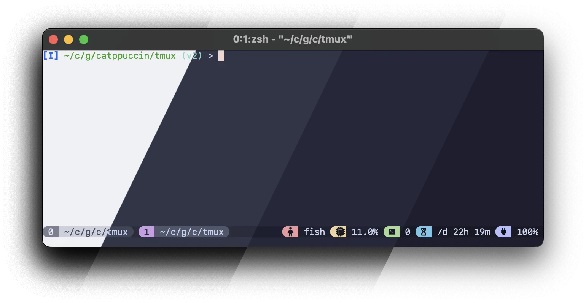
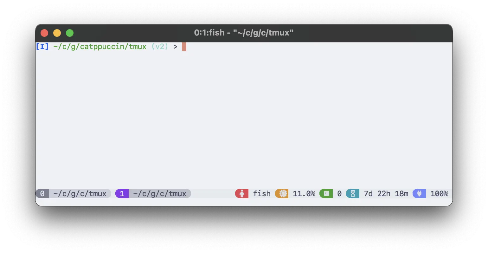
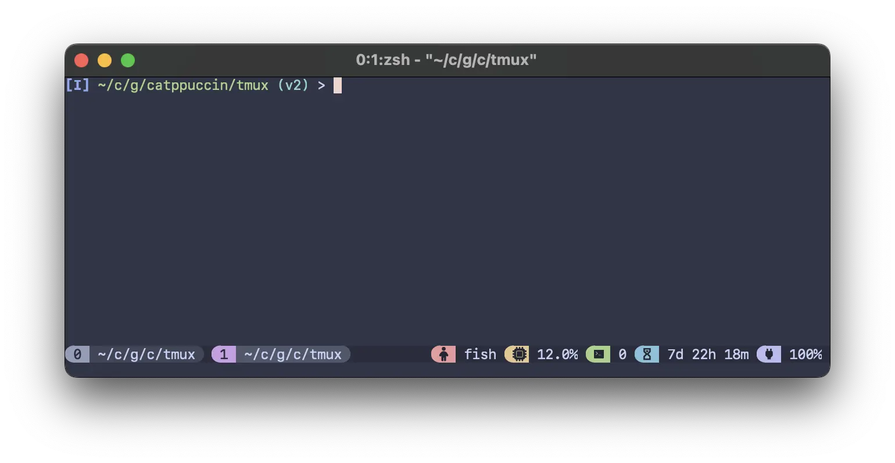
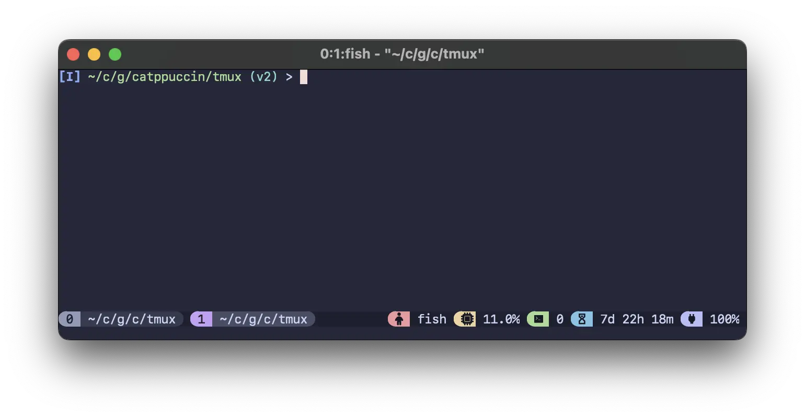
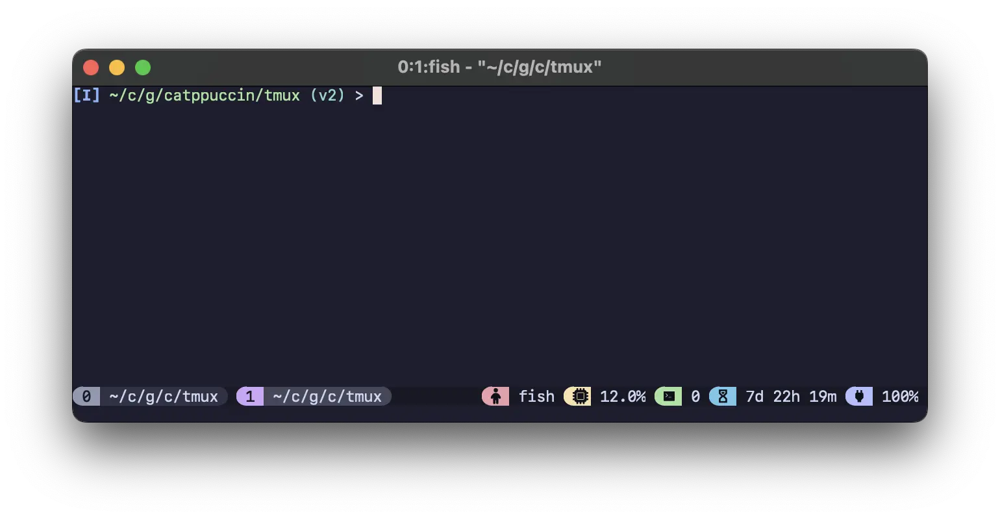

<!-- markdownlint-disable -->
<h3 align="center">
 <br/>
 
 Catppuccin for <a href="https://github.com/tmux/tmux">Tmux</a>
 
</h3>

<p align="center">
    <a href="https://github.com/catppuccin/tmux/stargazers"></a>
    <a href="https://github.com/catppuccin/tmux/issues"></a>
    <a href="https://github.com/catppuccin/tmux/contributors"></a>
</p>

<p align="center">
  
</p>
<!-- markdownlint-enable -->

## Themes

<details>
<summary>🌻 Latte</summary>



</details>
<details>
<summary>🪴 Frappé</summary>



</details>
<details>
<summary>🌺 Macchiato</summary>



</details>
<details>
<summary>🌿 Mocha</summary>



</details>

## Installation

In order to have the icons displayed correctly please use/update your favorite
[nerd font](https://www.nerdfonts.com/font-downloads).
If you do not have a patched font installed, you can override or remove any
icon. Check the [documentation](./docs/reference/configuration.md) on the
options available.

### Manual (Recommended)

This method is recommended as TPM has some issues with name conflicts.

<!-- x-release-please-start-version -->

1. Clone this repository to your desired location (e.g.
   `~/.config/tmux/plugins/catppuccin`).

   ```bash
   mkdir -p ~/.config/tmux/plugins/catppuccin
   git clone -b v2.2.2 https://github.com/catppuccin/tmux.git ~/.config/tmux/plugins/catppuccin/tmux
   ```

1. Add the following line to your `tmux.conf` file:
   `run ~/.config/tmux/plugins/catppuccin/tmux/catppuccin.tmux`.
1. Reload Tmux by either restarting or reloading with `tmux source ~/.tmux.conf`.
<!-- x-release-please-end -->

Check out what to do next in the "[Getting Started Guide](./docs/tutorials/01-getting-started.md)".

### TPM

<!-- x-release-please-start-version -->

1.  Install [TPM](https://github.com/tmux-plugins/tpm)
1.  Add the Catppuccin plugin:

    ```bash
    set -g @plugin 'catppuccin/tmux#v2.2.2' # See https://github.com/catppuccin/tmux/tags for additional tags
    # ...alongside
    set -g @plugin 'tmux-plugins/tpm'
    ```

1.  (Optional) Set your preferred flavor, it defaults to `"mocha"`:

    ```bash
    set -g @catppuccin_flavor 'mocha' # latte, frappe, macchiato or mocha
    ```

    <!-- x-release-please-end -->

> [!IMPORTANT]
> You may have to run `~/.config/tmux/plugins/tpm/bin/clean_plugins`
> if upgrading from an earlier version
> (especially from `v0.3.0`).

### For TMUX versions prior to 3.2

This plugin uses features that were only introduced into tmux in version 3.2.
If you are using a version earlier than this, you can still have lovely
catppuccin colors, the installation method just looks a little different.

```sh
# In your ~/.tmux.conf

# Add the colors from the pallete. Check the themes/ directory for all options.

# Some basic mocha colors.
set -g @ctp_bg "#24273a"
set -g @ctp_surface_1 "#494d64"
set -g @ctp_fg "#cad3f5"
set -g @ctp_mauve "#c6a0f6"
set -g @ctp_crust "#181926"

# status line
set -gF status-style "bg=#{@ctp_bg},fg=#{@ctp_fg}"

# windows
set -gF window-status-format "#[bg=#{@ctp_surface_1},fg=#{@ctp_fg}] ##I ##T "
set -gF window-status-current-format "#[bg=#{@ctp_mauve},fg=#{@ctp_crust}] ##I ##T "
```

### For TMUX versions prior to 3.6

This plugin can be used in conjunction with the support for tmux to
automatically report dark or light themes using hooks. You can leverage these
hooks in your tmux configuration file like so:

```conf
set-hook -g client-dark-theme {
  set -g @catppuccin_flavor "frappe"
  set -g @catppuccin_reset "true"

  # NOTE: you may need to set more `@catppuccin_*` variables to fully reset
  # everything.

  run ~/code/github.com/catppuccin/tmux/catppuccin.tmux
}
set-hook -g client-light-theme {
  set -g @catppuccin_flavor "latte"
  set -g @catppuccin_reset "true"

  # NOTE: you may need to set more `@catppuccin_*` variables to fully reset
  # everything.

  run ~/code/github.com/catppuccin/tmux/catppuccin.tmux
}
```

The above is only possible with versions of tmux 3.6+. To replicate this
functionality with versions prior to 3.6, you can will need to set variables and
run the `cappuccin.tmux` file and trigger it yourself. If you'd like some
inspiration for how to do this, read through [the Bash code found in this Nix
function here][reload-example] which reloads Catppuccin on-demand without
relying on tmux hooks.

[reload-example]: https://git.sr.ht/~rogeruiz/.files.nix/tree/1dedf4da47f995ec41e07d37b65008ad0f464717/item/module/tools/terminal/tmux/catppuccin/bin/default.nix "An example from a catppuccin/tmux maintainer on how to manually reload the Catppuccin configuration on macOS."

> [!IMPORTANT]
> As mentioned in the comments in the `conf` snippet above, you may find that
> you'll need to add to the list of `@catppuccin_*` variables. Test your
> configuration by switching themes and noting what of the Tmux session isn't
> getting reset to an expected color.

### Upgrading from v0.3

Breaking changes have been introduced since 0.3, to understand how to migrate
your configuration, see pinned issue [#487](https://github.com/catppuccin/tmux/issues/487).

## Recommended Default Configuration

This configuration shows some customisation options, that can be further
extended as desired.
This is what is used for the previews above.


```bash
# ~/.tmux.conf

# Options to make tmux more pleasant
set -g mouse on
set -g default-terminal "tmux-256color"

# Configure the catppuccin plugin
set -g @catppuccin_flavor "mocha"
set -g @catppuccin_window_status_style "rounded"

# Load catppuccin
run ~/.config/tmux/plugins/catppuccin/tmux/catppuccin.tmux
# For TPM, instead use `run ~/.tmux/plugins/tmux/catppuccin.tmux`

# Make the status line pretty and add some modules
set -g status-right-length 100
set -g status-left-length 100
set -g status-left ""
set -g status-right "#{E:@catppuccin_status_application}"
set -agF status-right "#{E:@catppuccin_status_cpu}"
set -agF status-right "#{E:@catppuccin_status_ram}"
set -ag status-right "#{E:@catppuccin_status_session}"
set -ag status-right "#{E:@catppuccin_status_uptime}"
set -agF status-right "#{E:@catppuccin_status_battery}"

run ~/.config/tmux/plugins/tmux-plugins/tmux-cpu/cpu.tmux
run ~/.config/tmux/plugins/tmux-plugins/tmux-battery/battery.tmux
# Or, if using TPM, just run TPM
```

## Documentation

### Guides

- [Getting Started](./docs/tutorials/01-getting-started.md)
- [Custom Status Line Segments](./docs/tutorials/02-custom-status.md)
- [Troubleshooting](./docs/guides/troubleshooting.md)

### Reference

- [Status Line](./docs/reference/status-line.md)
- [Configuration Options Reference](./docs/reference/configuration.md)
- [Tmux Configuration Showcase](https://github.com/catppuccin/tmux/discussions/317)

## 💝 Thanks to

- [Pocco81](https://github.com/Pocco81)
- [vinnyA3](https://github.com/vinnyA3)
- [rogeruiz](https://github.com/rogeruiz)
- [kales](https://github.com/kjnsn)

&nbsp;

<!-- markdownlint-disable -->
<p align="center">
</p>
<p align="center">Copyright &copy; 2021-present <a href="https://github.com/catppuccin" target="_blank">Catppuccin Org</a>
<p align="center"><a href="https://github.com/catppuccin/catppuccin/blob/main/LICENSE"></a></p>
<!-- markdownlint-enable -->
