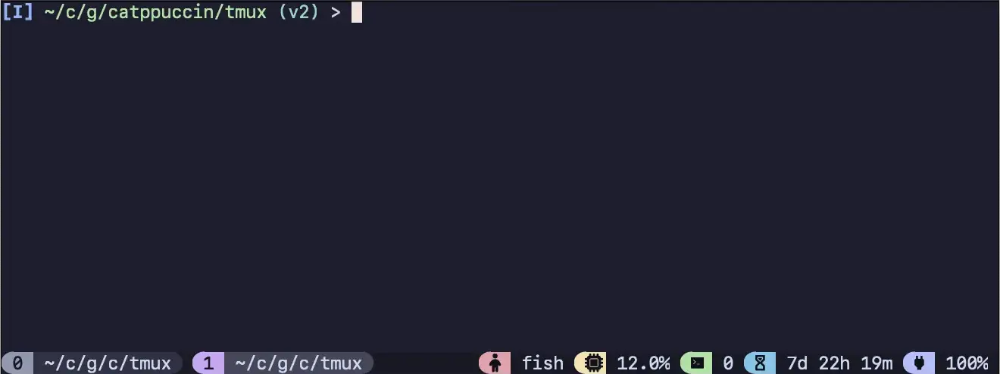

<!-- markdownlint-disable -->
<h3 align="center">
 <br/>
 
 gruvbox for <a href="https://github.com/tmux/tmux">Tmux</a>
 
</h3>

<p align="center">
    <a href="https://github.com/gruvbox/tmux/stargazers"></a>
    <a href="https://github.com/gruvbox/tmux/issues"></a>
    <a href="https://github.com/gruvbox/tmux/contributors"></a>
</p>

<p align="center">
  
</p>
<!-- markdownlint-enable -->

## Themes

<details>
<summary>🌻 Latte</summary>


</details>
<details>
<summary>🪴 Frappé</summary>


</details>
<details>
<summary>🌺 Macchiato</summary>


</details>
<details>
<summary>🌿 Mocha</summary>



</details>

## Installation

In order to have the icons displayed correctly please use/update your favorite
[nerd font](https://www.nerdfonts.com/font-downloads).
If you do not have a patched font installed, you can override or remove any
icon. Check the [documentation](./docs/reference/configuration.md) on the
options available.

### Manual (Recommended)

This method is recommended as TPM has some issues with name conflicts.

<!-- x-release-please-start-version -->

1. Clone this repository to your desired location (e.g.
   `~/.config/tmux/plugins/gruvbox`).

   ```bash
   mkdir -p ~/.config/tmux/plugins/gruvbox
   git clone -b v2.1.2 https://github.com/gruvbox/tmux.git ~/.config/tmux/plugins/gruvbox/tmux
   ```

1. Add the following line to your `tmux.conf` file:
   `run ~/.config/tmux/plugins/gruvbox/tmux/gruvbox.tmux`.
1. Reload Tmux by either restarting or reloading with `tmux source ~/.tmux.conf`.
<!-- x-release-please-end -->

Check out what to do next in the "[Getting Started Guide](./docs/tutorials/01-getting-started.md)".

### TPM

<!-- x-release-please-start-version -->

1.  Install [TPM](https://github.com/tmux-plugins/tpm)
1.  Add the gruvbox plugin:

    ```bash
    set -g @plugin 'gruvbox/tmux#v2.1.2' # See https://github.com/gruvbox/tmux/tags for additional tags
    # ...alongside
    set -g @plugin 'tmux-plugins/tpm'
    ```

1.  (Optional) Set your preferred flavor, it defaults to `"mocha"`:

        ```bash
        set -g @gruvbox_flavor 'mocha' # latte, frappe, macchiato or mocha
        ```

    <!-- x-release-please-end -->

> [!IMPORTANT]
> You may have to run `~/.config/tmux/plugins/tpm/bin/clean_plugins`
> if upgrading from an earlier version
> (especially from `v0.3.0`).

### For TMUX versions prior to 3.2

This plugin uses features that were only introduced into tmux in version 3.2.
If you are using a version earlier than this, you can still have lovely
gruvbox colors, the installation method just looks a little different.

```sh
# In your ~/.tmux.conf

# Add the colors from the pallete. Check the themes/ directory for all options.

# Some basic mocha colors.
set -g @ctp_bg "#24273a"
set -g @ctp_surface_1 "#494d64"
set -g @ctp_fg "#cad3f5"
set -g @ctp_purple "#c6a0f6"
set -g @ctp_crust "#181926"

# status line
set -gF status-style "bg=#{@ctp_bg},fg=#{@ctp_fg}"

# windows
set -gF window-status-format "#[bg=#{@ctp_surface_1},fg=#{@ctp_fg}] ##I ##T "
set -gF window-status-current-format "#[bg=#{@ctp_purple},fg=#{@ctp_crust}] ##I ##T "
```

### Upgrading from v0.3

Breaking changes have been introduced since 0.3, to understand how to migrate
your configuration, see pinned issue [#291](https://github.com/gruvbox/tmux/issues/291).

## Recommended Default Configuration

This configuration shows some customisation options, that can be further
extended as desired.
This is what is used for the previews above.


```bash
# ~/.tmux.conf

# Options to make tmux more pleasant
set -g mouse on
set -g default-terminal "tmux-256color"

# Configure the gruvbox plugin
set -g @gruvbox_flavor "mocha"
set -g @gruvbox_window_status_style "rounded"

# Load gruvbox
run ~/.config/tmux/plugins/gruvbox/tmux/gruvbox.tmux
# For TPM, instead use `run ~/.config/tmux/plugins/tmux/gruvbox.tmux`

# Make the status line pretty and add some modules
set -g status-right-length 100
set -g status-left-length 100
set -g status-left ""
set -g status-right "#{E:@gruvbox_status_application}"
set -agF status-right "#{E:@gruvbox_status_cpu}"
set -ag status-right "#{E:@gruvbox_status_session}"
set -ag status-right "#{E:@gruvbox_status_uptime}"
set -agF status-right "#{E:@gruvbox_status_battery}"

run ~/.config/tmux/plugins/tmux-plugins/tmux-cpu/cpu.tmux
run ~/.config/tmux/plugins/tmux-plugins/tmux-battery/battery.tmux
# Or, if using TPM, just run TPM
```

## Documentation

### Guides

- [Getting Started](./docs/tutorials/01-getting-started.md)
- [Custom Status Line Segments](./docs/tutorials/02-custom-status.md)
- [Troubleshooting](./docs/guides/troubleshooting.md)

### Reference

- [Status Line](./docs/reference/status-line.md)
- [Configuration Options Reference](./docs/reference/configuration.md)
- [Tmux Configuration Showcase](https://github.com/gruvbox/tmux/discussions/317)

## 💝 Thanks to

- [Pocco81](https://github.com/Pocco81)
- [vinnyA3](https://github.com/vinnyA3)
- [rogeruiz](https://github.com/rogeruiz)
- [kales](https://github.com/kjnsn)

&nbsp;

<!-- markdownlint-disable -->
<p align="center">
</p>
<p align="center">Copyright &copy; 2021-present <a href="https://github.com/gruvbox" target="_blank">gruvbox Org</a>
<p align="center"><a href="https://github.com/gruvbox/gruvbox/blob/main/LICENSE"></a></p>
<!-- markdownlint-enable -->
