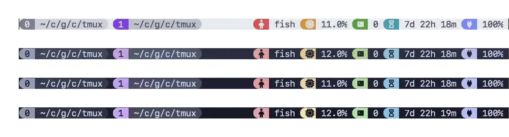

<h3 align="center">
	<br/>
	
	Catppuccin for <a href="https://github.com/tmux/tmux">Tmux</a>
	
</h3>

<p align="center">
    <a href="https://github.com/catppuccin/tmux/stargazers"></a>
    <a href="https://github.com/catppuccin/tmux/issues"></a>
    <a href="https://github.com/catppuccin/tmux/contributors"></a>
</p>

<p align="center">
  
</p>

## Content

1. [Themes](#themes)
1. [Installation](#installation)
1. [Overview](#overview)
1. [Configuration options](#configuration-options)
   1. [Window](#window)
   1. [Window default](#window-default)
   1. [Window current](#window-current)
   1. [Status](#status)
   1. [Pane](#pane)
   1. [Customizing modules](#customizing-modules)
   1. [Battery module](#battery-module)
   1. [CPU module](#CPU-module)
   1. [Weather modules](#weather-modules)
   1. [Load module](#load-module)
1. [Create a custom module](#create-a-custom-module)
1. [Configuration Examples](#configuration-examples)
   1. [Config 1](#config-1)
   1. [Config 2](#config-2)
   1. [Config 3](#config-3)

## Themes

- 🌻 [Latte](./themes/catppuccin_latte.tmuxtheme)
- 🪴 [Frappé](./themes/catppuccin_frappe.tmuxtheme)
- 🌺 [Macchiato](./themes/catppuccin_macchiato.tmuxtheme)
- 🌿 [Mocha](./themes/catppuccin_mocha.tmuxtheme)

## Installation

In order to have the icons displayed correctly please use/update your favorite [patched font](https://www.nerdfonts.com/font-downloads).
If you do not have a patched font installed, you can override or remove any icon. Check the documentation below on the options available.

### TPM

1. Install [TPM](https://github.com/tmux-plugins/tpm)
2. Add the Catppuccin plugin:

```bash
set -g @plugin 'catppuccin/tmux#latest' # See https://github.com/catppuccin/tmux/tags for additional tags
# set -g @plugin 'catppuccin/tmux' # main branch
# ...alongside
set -g @plugin 'tmux-plugins/tpm'
```

3. (Optional) Set your preferred flavor, it defaults to `"mocha"`:

```bash
set -g @catppuccin_flavor 'mocha' # latte,frappe, macchiato or mocha
```

### Manual

1. Clone this repository to your desired location (e.g.
   `~/.config/tmux/plugins/catppuccin`)
2. Add the following line to your `tmux.conf` file:
    `run ~/.config/tmux/plugins/catppuccin/catppuccin.tmux`
3. (Optional) Set your preferred flavor and/or add configuration options as
   listed in [Configuration Options](#configuration-options).
4. Reload Tmux by either restarting the session or reloading it with `tmux source-file ~/.tmux.conf`

## Overview


This is a diagram of how the theme is split between its components.

## Configuration options

All flavors support certain levels of customization that match our [Catppuccin
Style Guide][style-guide]. To add these customizations, add any of the following
options to your Tmux configuration.

### Window

### Set the window separator
```sh
set -g @catppuccin_window_separator ""
```

#### Set the window left separator:
```sh
set -g @catppuccin_window_left_separator "█"
```

#### Set the window middle separator:
```sh
set -g @catppuccin_window_middle_separator "█"
```

#### Set the window right separator:
```sh
set -g @catppuccin_window_right_separator "█"
```

#### Position the number:
```sh
set -g @catppuccin_window_number_position "left"
```
Values:
- left - the number will be on the left part of the window
- right - the number will be on the right part of the window

#### Enable window status:
```sh
set -g @catppuccin_window_status "no"
```
Values:
- no - this will disable the window status part
- icon - this will replace the windows status text with icons
- text - this will keep the windows status in text format

#### Override windows status icons
```sh
set -g @catppuccin_icon_window_last "󰖰"
set -g @catppuccin_icon_window_current "󰖯"
set -g @catppuccin_icon_window_zoom "󰁌"
set -g @catppuccin_icon_window_mark "󰃀"
set -g @catppuccin_icon_window_silent "󰂛"
set -g @catppuccin_icon_window_activity "󱅫"
set -g @catppuccin_icon_window_bell "󰂞"
```

### Window default

#### Set the window default color fill:
```sh
set -g @catppuccin_window_default_fill "number"
```
Values:
- number - only the number of the window part will have color
- all - the entire window part will have the same color
- none - the entire window part will have no color

#### Override the window default colors:
```sh
set -g @catppuccin_window_default_color "#{thm_blue}" # text color
set -g @catppuccin_window_default_background "#{thm_gray}"
```

Values:
- color - a theme color (`#{thm_<color>}`) or hexadecimal color value

#### Override the window default text:
```sh
set -g @catppuccin_window_default_text "#{b:pane_current_path}" # use "#W" for application instead of directory
```

### Window current

#### Set the window current color fill:
```sh
set -g @catppuccin_window_current_fill "number"
```
Values:
- number - only the number of the window part will have color
- all - the entire window part will have the same color
- none - the entire window part will have no color

#### Override the window current colors:
```sh
set -g @catppuccin_window_current_color "#{thm_orange}" # text color
set -g @catppuccin_window_current_background "#{thm_bg}"
```
Note that color and background fields are swapped when `@catppuccin_window_current_fill` is set to "all".

Values:
- color - a theme color (`#{thm_<color>}`) or a hexadecimal color value

#### Override the window current text:
```sh
set -g @catppuccin_window_current_text "#{b:pane_current_path}" # use "#W" for application instead of directory
```

### Pane

#### Set the pane border style:

```sh
set -g @catppuccin_pane_border_style "fg=#{thm_gray}" # Use a value compatible with the standard tmux 'pane-border-style'
```

#### Set the pane active border style:

```sh
set -g @catppuccin_pane_active_border_style "fg=#{thm_orange}" # Use a value compatible with the standard tmux 'pane-border-active-style'
```

### Menu

#### Set the menu style:

```sh
set -g @catppuccin_menu_style "default" # Use a value compatible with the standard tmux `menu-style`
```

#### Set the menu selected style:

```sh
set -g @catppuccin_menu_selected_style "fg=#{thm_gray},bg=#{thm_yellow}" # Use a value compatible with the standard tmux `menu-selected-style`
```

### Set the menu border style:

```sh
set -g @catppuccin_menu_border_style "default" # Use a value compatible with the standard tmux `menu-border-style`
```

### Status
#### Set the default status bar visibility
```sh
set -g @catppuccin_status_default "on"

```

#### Override the default status background color
```sh
set -g @catppuccin_status_background "theme"
```
This will overwrite the status bar background:
- "theme" will use the color from the selected theme
- "default" will make the status bar transparent
- use hex color codes for other colors or a theme color (`#{thm_<color>}`)

Note: you need to restart tmux for this to take effect: 
```sh
tmux kill-server & tmux
```

#### Set the status module left separator:
```sh
set -g @catppuccin_status_left_separator ""
```

#### Set the status module right separator:
```sh
set -g @catppuccin_status_right_separator "█"
```

#### Set the status connect separator:
```sh
set -g @catppuccin_status_connect_separator "yes"
```
Values:
- yes - the background color of the separator will not blend in with the background color of tmux
- no - the background color of the separator will blend in with the background color of tmux


#### Set the status module color fill:
```sh
set -g @catppuccin_status_fill "icon"
```
Values:
- icon - only the icon of the module will have color
- all - the entire module will have the same color

#### Set the status module justify value:
```sh
set -g @catppuccin_status_justify "left"
```
Values:
- left 
- centre - puts the window list in the relative centre of the available free space
- right
- absolute-centre - uses the centre of the entire horizontal space

### Pane

```sh
set -g @catppuccin_pane_status_enabled "no"
set -g @catppuccin_pane_border_status "off" # See `pane-border-status`
set -g @catppuccin_pane_left_separator "█"
set -g @catppuccin_pane_right_separator "█"
set -g @catppuccin_pane_middle_separator "█"
set -g @catppuccin_pane_number_position "left"
set -g @catppuccin_pane_default_fill "number"
set -g @catppuccin_pane_default_text "#{b:pane_current_path}"
set -g @catppuccin_pane_border_style "fg=#{thm_orange}"
set -g @catppuccin_pane_active_border_style "fg=#{thm_orange}"
set -g @catppuccin_pane_color "#{thm_orange}"
set -g @catppuccin_pane_background_color "#{thm_orange}"
```

#### Set the module list
```sh
set -g @catppuccin_status_modules_right "application session"
set -g @catppuccin_status_modules_left "null"
```
Provide a list of modules and the order in which you want them to appear in the status.

Available modules:
- application - display the current window running application
- directory - display the basename of the current window path
- session - display the number of tmux sessions running
- user - display the username
- host - display the hostname
- date_time - display the date and time
- uptime - display the uptime
- [battery](#battery-module) - display the battery

### Customizing modules

Every module (except the module "session") supports the following overrides:

#### Override the specific module icon
```sh
set -g @catppuccin_[module_name]_icon "icon"
```

#### Override the specific module color
```sh
set -g @catppuccin_[module_name]_color "color"
```

#### Override the specific module text
```sh
set -g @catppuccin_[module_name]_text "text"
```

#### Removing a specific module option
```sh
set -g @catppuccin_[module_name]_[option] "null"
```
This is for the situation where you want to remove the icon from a module.
Ex:
```sh
set -g @catppuccin_date_time_icon "null"
```

### Battery module

#### Requirements
This module depends on [tmux-battery](https://github.com/tmux-plugins/tmux-battery/tree/master).

#### Install
The preferred way to install tmux-battery is using [TPM](https://github.com/tmux-plugins/tpm).

#### Configure
Load tmux-battery after you load catppuccin.
```sh
set -g @plugin 'catppuccin/tmux'
...
set -g @plugin 'tmux-plugins/tmux-battery'
```

Add the battery module to the status modules list.
```sh
set -g @catppuccin_status_modules_right "... battery ..."
```

### CPU module

#### Requirements
This module depends on [tmux-cpu](https://github.com/tmux-plugins/tmux-cpu/tree/master).

#### Install
The preferred way to install tmux-cpu is using [TPM](https://github.com/tmux-plugins/tpm).

#### Configure
Load tmux-cpu after you load catppuccin.
```sh
set -g @plugin 'catppuccin/tmux'
...
set -g @plugin 'tmux-plugins/tmux-cpu'
```

Add the cpu module to the status modules list.
```sh
set -g @catppuccin_status_modules_right "... cpu ..."
```

### Weather modules

#### tmux-weather

##### Requirements
This module depends on [tmux-weather](https://github.com/xamut/tmux-weather).

##### Install
The preferred way to install tmux-weather is using [TPM](https://github.com/tmux-plugins/tpm).

##### Configure
Load tmux-weather after you load catppuccin.
```sh
set -g @plugin 'catppuccin/tmux'
...
set -g @plugin 'xamut/tmux-weather'
```

Add the weather module to the status modules list.
```sh
set -g @catppuccin_status_modules_right "... weather ..."
```

#### tmux-clima

##### Requirements
This module depends on [tmux-clima](https://github.com/vascomfnunes/tmux-clima).

##### Install
The preferred way to install tmux-clima is using [TPM](https://github.com/tmux-plugins/tpm).

##### Configure
Load tmux-clima after you load catppuccin.
```sh
set -g @plugin 'catppuccin/tmux'
...
set -g @plugin 'vascomfnunes/tmux-clima'
```

Add the weather module to the status modules list.
```sh
set -g @catppuccin_status_modules_right "... clima ..."
```

### Load module

#### Requirements
This module depends on [tmux-loadavg](https://github.com/jamesoff/tmux-loadavg).

#### Install
The preferred way to install tmux-loadavg is using [TPM](https://github.com/tmux-plugins/tpm).

#### Configure
Load tmux-loadavg after you load catppuccin.
```sh
set -g @plugin 'catppuccin/tmux'
...
set -g @plugin 'jamesoff/tmux-loadavg'
```

Add the load module to the status modules list.
```sh
set -g @catppuccin_status_modules_right "... load ..."
```

### Gitmux module

#### Requirements
This module depends on [gitmux](https://github.com/arl/gitmux).

#### Install
To install gitmux, follow the instructions in the [gitmux documentation](https://github.com/arl/gitmux/blob/main/README.md#installing).

#### Configure
Add the gitmux module to the status modules list.
```sh
set -g @catppuccin_status_modules_right "... gitmux ..."
```

To customize the gitmux module, you can follow the instrucctions in the [gitmux documentation](https://github.com/arl/gitmux/blob/main/README.md#customizing) and add this line in your tmux configuration:
```sh
set -g @catppuccin_gitmux_text "#(gitmux -cfg $HOME/.gitmux.conf \"#{pane_current_path}\")"
```

### Pomodoro module

#### Requirements
This module depends on [tmux-pomodoro-plus](https://github.com/olimorris/tmux-pomodoro-plus/tree/main).

#### Install
The preferred way to install tmux-pomodoro-plus is using [TPM](https://github.com/tmux-plugins/tpm).

#### Configure
Load tmux-pomodoro-plus after you load catppuccin.
```sh
set -g @plugin 'catppuccin/tmux'
...
set -g @plugin 'olimorris/tmux-pomodoro-plus'
```

Add the pomodoro module to the status modules list.
```sh
set -g @catppuccin_status_modules_right "... pomodoro_plus ..."
```


### Kube module

#### Requirements
This module depends on [kube-tmux](https://github.com/jonmosco/kube-tmux).

#### Install
The preferred way to install kube-tmux is using [TPM](https://github.com/tmux-plugins/tpm).

#### Configure
```sh
set -g @plugin 'catppuccin/tmux'
...
set -g @plugin 'jonmosco/kube-tmux'
```

Add the tmux module to the status modules list.
```sh
set -g @catppuccin_status_modules_right "... kube ..."
```

Optionally override the kube-tmux colors
```sh
set -g @catppuccin_kube_context_color "#{thm_red}"
set -g @catppuccin_kube_namespace_color "#{thm_cyan}"
```


## Create a custom module

It is possible to add a new custom module or overwrite any of the existing modules.

For further details, see the documentation in [custom/README.md](custom/README.md)

Any file added to the custom folder will be preserved when updating catppuccin.

## Configuration Examples
Below are provided a few configurations as examples or starting points.

Note:
When switching between configurations run:
```sh
tmux kill-server
```
To kill the tmux server and clear all global variables.


### Config 1


```sh
set -g @catppuccin_window_right_separator "█ "
set -g @catppuccin_window_number_position "right"
set -g @catppuccin_window_middle_separator " | "

set -g @catppuccin_window_default_fill "none"

set -g @catppuccin_window_current_fill "all"

set -g @catppuccin_status_modules_right "application session user host date_time"
set -g @catppuccin_status_left_separator "█"
set -g @catppuccin_status_right_separator "█"

set -g @catppuccin_date_time_text "%Y-%m-%d %H:%M:%S"
```

### Config 2


```sh
set -g @catppuccin_window_left_separator "█"
set -g @catppuccin_window_right_separator "█ "
set -g @catppuccin_window_number_position "right"
set -g @catppuccin_window_middle_separator "  █"

set -g @catppuccin_window_default_fill "number"

set -g @catppuccin_window_current_fill "number"
set -g @catppuccin_window_current_text "#{pane_current_path}"

set -g @catppuccin_status_modules_right "application session date_time"
set -g @catppuccin_status_left_separator  ""
set -g @catppuccin_status_right_separator " "
set -g @catppuccin_status_fill "all"
set -g @catppuccin_status_connect_separator "yes"
```

### Config 3


```sh
set -g @catppuccin_window_left_separator ""
set -g @catppuccin_window_right_separator " "
set -g @catppuccin_window_middle_separator " █"
set -g @catppuccin_window_number_position "right"

set -g @catppuccin_window_default_fill "number"
set -g @catppuccin_window_default_text "#W"

set -g @catppuccin_window_current_fill "number"
set -g @catppuccin_window_current_text "#W"

set -g @catppuccin_status_modules_right "directory user host session"
set -g @catppuccin_status_left_separator  " "
set -g @catppuccin_status_right_separator ""
set -g @catppuccin_status_fill "icon"
set -g @catppuccin_status_connect_separator "no"

set -g @catppuccin_directory_text "#{pane_current_path}"
```

[style-guide]: https://github.com/catppuccin/catppuccin/blob/main/docs/style-guide.md

## 💝 Thanks to

- [Pocco81](https://github.com/catppuccin)
- [vinnyA3](https://github.com/vinnyA3)
- [rogeruiz](https://github.com/rogeruiz)

&nbsp;

<p align="center"></p>
<p align="center">Copyright &copy; 2021-present <a href="https://github.com/catppuccin" target="_blank">Catppuccin Org</a>
<p align="center"><a href="https://github.com/catppuccin/catppuccin/blob/main/LICENSE"></a></p>

