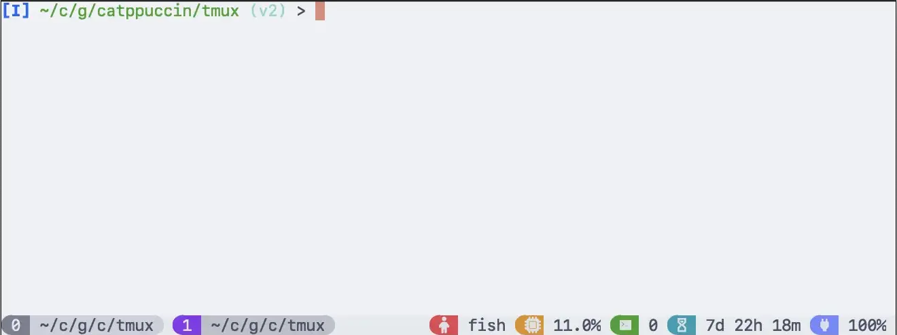
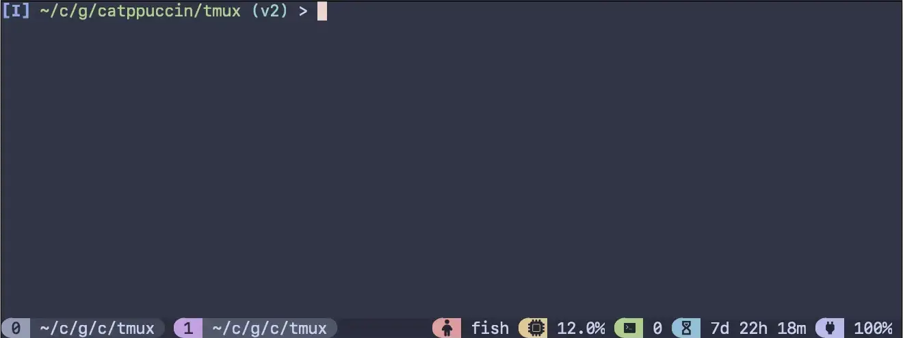
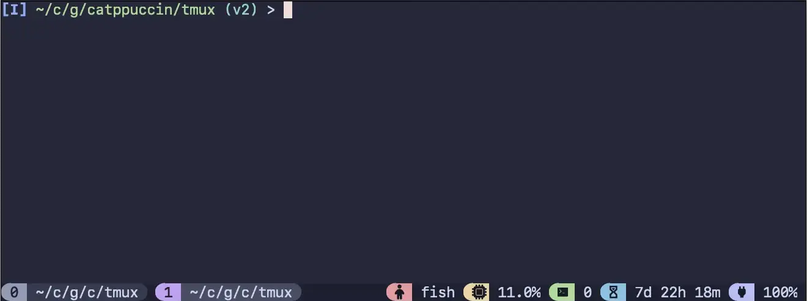
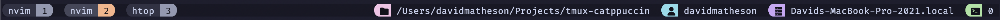

<!-- markdownlint-disable -->
<h3 align="center">
 <br/>
 
 Catppuccin for <a href="https://github.com/tmux/tmux">Tmux</a>
 
</h3>

<p align="center">
    <a href="https://github.com/catppuccin/tmux/stargazers"></a>
    <a href="https://github.com/catppuccin/tmux/issues"></a>
    <a href="https://github.com/catppuccin/tmux/contributors"></a>
</p>

<p align="center">
  
</p>
<!-- markdownlint-enable -->

## Content

<!--toc:start-->

- [Content](#content)
- [Themes](#themes)
- [Installation](#installation)
  - [Manual (Recommended)](#manual-recommended)
  - [TPM](#tpm)
  - [For TMUX versions prior to 3.2](#for-tmux-versions-prior-to-32)
  - [Upgrading from v0.3](#upgrading-from-v03)
- [Recommended Default Configuration](#recommended-default-configuration)
- [Overview](#overview)
- [Configuration options](#configuration-options)
  - [Window](#window)
  - [Pane](#pane)
    - [Set the pane border style](#set-the-pane-border-style)
    - [Set the pane active border style](#set-the-pane-active-border-style)
  - [Menu](#menu)
  - [Status Line](#status-line)
  - [Pane Options](#pane-options)
  - [Using the theme's built-in status modules](#using-the-themes-built-in-status-modules)
- [Configuration Examples](#configuration-examples)
  - [Config 1](#config-1)
  - [Config 2](#config-2)
  - [Config 3](#config-3)
  <!--toc:end-->

## Themes

<details>
<summary>🌻 Latte</summary>



</details>
<details>
<summary>🪴 Frappé</summary>



</details>
<details>
<summary>🌺 Macchiato</summary>



</details>
<details>
<summary>🌿 Mocha</summary>


</details>

## Installation

> [!IMPORTANT]
> The plugin was re-written from bash to use tmux's native configuration
> language. This occurred after `v0.3.0`. Old configurations will
> need to be updated. Please consider if the upgrade is worth the tradeoff.

In order to have the icons displayed correctly please use/update your favorite
 [patched font](https://www.nerdfonts.com/font-downloads).
If you do not have a patched font installed, you can override or remove any
icon. Check the documentation below on the options available.

> [!NOTE]
> If you are using a tmux version older than 3.0, you
> will need to follow the instructions for [older versions](#for-tmux-versions-prior-to-32).

### Manual (Recommended)

This method is recommended as TPM has some issues with name conflicts.

1. Clone this repository to your desired location (e.g.
   `~/.config/tmux/plugins/catppuccin`).

    ```bash
    mkdir -p ~/.config/tmux/plugins/catppuccin
    git clone https://github.com/catppuccin/tmux.git ~/.config/tmux/plugins/catppuccin/tmux
    ```

1. Add the following line to your `tmux.conf` file:
   `run ~/.config/tmux/plugins/catppuccin/tmux/catppuccin.tmux`
1. (Optional) Set your preferred flavor and/or add configuration options as
   listed in [Configuration Options](#configuration-options).
   These options must be added above the `run ~/.config...` line.
1. Reload Tmux by either restarting or reloading with `tmux source ~/.tmux.conf`

> [!IMPORTANT]
> You may have to run `~/.config/tmux/plugins/tpm/bin/clean_plugins`
> if upgrading from an earlier version
> (especially from `v0.3.0`).

### TPM

<!-- x-release-please-start-version -->
1. Install [TPM](https://github.com/tmux-plugins/tpm)
1. Add the Catppuccin plugin:

    ```bash
    set -g @plugin 'catppuccin/tmux#v1.0.3' # See https://github.com/catppuccin/tmux/tags for additional tags
    # ...alongside
    set -g @plugin 'tmux-plugins/tpm'
    ```

1. (Optional) Set your preferred flavor, it defaults to `"mocha"`:

    ```bash
    set -g @catppuccin_flavor 'mocha' # latte, frappe, macchiato or mocha
    ```
<!-- x-release-please-end -->

### For TMUX versions prior to 3.2

This plugin uses features that were only introduced into tmux in version 3.2.
If you are using a version earlier than this, you can still have lovely
catppuccin colors, the installation method just looks a little different.

```sh
# In your ~/.tmux.conf

# Add the colors from the pallete. Check the themes/ directory for all options.

# Some basic mocha colors.
set -g @ctp_bg "#24273a"
set -g @ctp_surface_1 "#494d64"
set -g @ctp_fg "#cad3f5"
set -g @ctp_mauve "#c6a0f6"
set -g @ctp_crust "#181926"

# status line
set -gF status-style "bg=#{@ctp_bg},fg=#{@ctp_fg}"

# windows
set -gF window-status-format "#[bg=#{@ctp_surface_1},fg=#{@ctp_fg}] ##I ##T "
set -gF window-status-current-format "#[bg=#{@ctp_mauve},fg=#{@ctp_crust}] ##I ##T "
```

### Upgrading from v0.3

Breaking changes have been introduced since 0.3, to understand how to migrate
your configuration, see pinned issue [#291](https://github.com/catppuccin/tmux/issues/291).

## Recommended Default Configuration

This configuration shows some customisation options, that can be further
extended as desired.
This is what is used for the previews above.


```bash
# ~/.tmux.conf

# Options to make tmux more pleasant
set -g mouse on
set -g default-terminal "tmux-256color"

# Configure the catppuccin plugin
set -g @catppuccin_flavor "mocha"
set -g @catppuccin_window_status_style "rounded"

# Load catppuccin
run ~/.config/tmux/plugins/catppuccin/tmux/catppuccin.tmux
# For TPM, instead use `run ~/.config/tmux/plugins/tmux/catppuccin.tmux`

# Make the status line pretty and add some modules
set -g status-right-length 100
set -g status-left ""
set -g status-right "#{E:@catppuccin_status_application}"
set -agF status-right "#{E:@catppuccin_status_cpu}"
set -ag status-right "#{E:@catppuccin_status_session}"
set -ag status-right "#{E:@catppuccin_status_uptime}"
set -agF status-right "#{E:@catppuccin_status_battery}"

run ~/.config/tmux/plugins/tmux-plugins/tmux-cpu/cpu.tmux
run ~/.config/tmux/plugins/tmux-plugins/tmux-battery/battery.tmux
# Or, if using TPM, just run TPM
```

## Overview


This is a diagram of how the theme is split between its components.

## Configuration options

All flavors support certain levels of customization that match our [Catppuccin
Style Guide][style-guide]. To add these customizations, add any of the following
options to your Tmux configuration.

### Window

The plugin comes with three window styles built in, these can be customized by
setting the `@catppuccin_window_status_style` option. The default is `basic`.

| Option    | Effect                                                                   | Preview                                               |
| --------- | ------------------------------------------------------------------------ | ----------------------------------------------------- |
| `basic`   | Simple styling with blocks.                                              |            |
| `rounded` | Each window is separated with rounded separators.                        |  |
| `slanted` | Each window is separated with slanted separators.                        |  |
| `custom`  | Custom separators are used. This is required to override the separators! |                                                       |
| `none`    | Styling of the window status is completely disabled.                     |        |

If you want to change the active color to something else (the default is mauve),
use the following. For example to use lavender:

```bash
set -g @catppuccin_window_current_number_color "#{@thm_lavender}"
```

<details>

<summary>Customising the separators</summary>

Add the following (above `set -g @plugin "catppuccin/tmux"` if using TPM),
setting whatever values you'd like for the separators:

```bash
set -g @catppuccin_window_status_style "custom"
set -g @catppuccin_window_left_separator ""
set -g @catppuccin_window_middle_separator ""
set -g @catppuccin_window_right_separator ""
```

</details>

### Pane

#### Set the pane border style

```sh
set -g @catppuccin_pane_border_style "fg=#{@thm_surface_0}" # Use a value compatible with the standard tmux 'pane-border-style'
```

#### Set the pane active border style

```sh
set -g @catppuccin_pane_active_border_style "fg=#{@thm_peach}" # Use a value compatible with the standard tmux 'pane-border-active-style'
```

### Menu

**Set the menu selected style:**

```sh
# Use a value compatible with the standard tmux `menu-selected-style`
set -g @catppuccin_menu_selected_style "fg=#{@thm_surface_0},bg=#{@thm_yellow}" 
```

### Status Line

**Set the default status bar visibility:**

```sh
set -g @catppuccin_status_default "on"

```

**Override the default status background color:**

```sh
set -g @catppuccin_status_background "default"
```

This will overwrite the status bar background:

- `default` will use the color from the selected theme
- `none` will make the status bar transparent
- use hex color codes for other colors or a theme color (`#{@thm_<color>}`)

Note: you need to restart tmux for this to take effect:

```sh
tmux kill-server && tmux
```

**Set the status module left separator:**

```sh
set -g @catppuccin_status_left_separator ""
```

**Set the status module right separator:**

```sh
set -g @catppuccin_status_right_separator "█"
```

**Set the status connect separator:**

```sh
set -g @catppuccin_status_connect_separator "yes"
```

Possible values:

- yes - the background color of the separator will not blend in with the background
  color of tmux
- no - the background color of the separator will blend in with the background
  color of tmux

**Set the status module color fill:**

```sh
set -g @catppuccin_status_fill "icon"
```

Values:

- icon - only the icon of the module will have color
- all - the entire module will have the same color

**Set the status module justify value:**

```sh
set -g @catppuccin_status_justify "left"
```

Values:

- `left`
- `centre` - puts the window list in the relative centre of the available free space
- `right`
- `absolute-centre` - uses the centre of the entire horizontal space

### Pane Options

By default no pane styling options are set. To enable, set
`@catppuccin_pane_status_enabled` to `yes`.

Defaults:

```sh
set -g @catppuccin_pane_status_enabled "no"
set -g @catppuccin_pane_border_status "off" # See `pane-border-status`
set -g @catppuccin_pane_left_separator "█"
set -g @catppuccin_pane_right_separator "█"
set -g @catppuccin_pane_middle_separator "█"
set -g @catppuccin_pane_number_position "left"
set -g @catppuccin_pane_default_fill "number"
set -g @catppuccin_pane_default_text "#{b:pane_current_path}"
set -g @catppuccin_pane_border_style "fg=#{@thm_overlay_0}"
set -g @catppuccin_pane_active_border_style "#{?pane_in_mode,fg=#{@thm_lavender},#{?pane_synchronized,fg=#{@thm_magenta},fg=#{@thm_lavender}}}"
set -g @catppuccin_pane_color "#{@thm_green}"
set -g @catppuccin_pane_background_color "#{@thm_surface_0}"
```

### Using the theme's built-in status modules

To use the theme's built in status modules, set the `status-left` and
`status-right` tmux options _after_ the plugin has been loaded.

The tmux status line modules are set as variables and prefixed with `@catppuccin_status_<module>`.

To use the `application` and `session` modules on the right and have nothing on
the left:

```sh
set -g status-right "#{E:@catppuccin_status_application}#{E:@catppuccin_status_session}"
set -g status-left ""
```

Available modules:

- `application` - display the current window running application
- `directory` - display the basename of the current window path
- `session` - display the number of tmux sessions running
- `user` - display the username
- `host` - display the hostname
- `date_time` - display the date and time
- `uptime` - display the uptime
- `battery` - display the battery

For a full list of modules and their options see [status](./docs/status-line-reference.md).

## Configuration Examples

Below are provided a few configurations as examples or starting points.

Note:
When switching between configurations run:

```sh
tmux kill-server
```

To kill the tmux server and clear all global variables.

### Config 1


```sh
# Disable catppuccin styling windows.
set -g @catppuccin_window_status_style "none"
set -g @catppuccin_status_left_separator "█"
set -g @catppuccin_status_right_separator "█"

set -g @catppuccin_date_time_text "%Y-%m-%d %H:%M:%S"

# Run catppuccin plugin manually or through tpm
# ...

# Style the windows. See https://man7.org/linux/man-pages/man1/tmux.1.html#STYLES for more details.
set -gF window-status-style "bg=#{@thm_surface_1},fg=#{@thm_fg}"
set -gF window-status-current-style "bg=#{@thm_peach},fg=#{@thm_crust}"

set -g window-status-format " #T | #I "
set -g window-status-current-format " #T | #I "

set -g status-left ""
set -g  status-right "#{E:@catppuccin_status_application}"
set -ag status-right "#{E:@catppuccin_status_session}"
set -ag status-right "#{E:@catppuccin_status_user}"
set -ag status-right "#{E:@catppuccin_status_host}"
set -ag status-right "#{E:@catppuccin_status_date_time}"
```

### Config 2


```sh
set -g @catppuccin_window_status_style "slanted"
set -g @catppuccin_window_number_position "right"
set -g @catppuccin_window_current_text "#{pane_current_path}"

set -g @catppuccin_status_left_separator  ""
set -g @catppuccin_status_right_separator " "
set -g @catppuccin_status_fill "all"
set -g @catppuccin_status_connect_separator "yes"

# Run catppuccin plugin manually or through tpm
# ...

set -g status-left ""
set -gF status-right "#{E:@catppuccin_status_application}#{E:@catppuccin_status_session}#{E:@catppuccin_status_date_time}"
```

### Config 3



```sh
set -g @catppuccin_window_status_style "rounded"
set -g @catppuccin_window_number_position "right"

set -g @catppuccin_window_default_fill "number"
set -g @catppuccin_window_default_text "#W "

set -g @catppuccin_window_current_fill "number"
set -g @catppuccin_window_current_text "#W "

set -g @catppuccin_status_left_separator  " "
set -g @catppuccin_status_right_separator ""
set -g @catppuccin_status_fill "icon"
set -g @catppuccin_status_connect_separator "no"

set -g @catppuccin_directory_text "#{pane_current_path}"

# Run catppuccin plugin manually or through tpm
# ...

set -g status-left ""
set -g  status-right "#{E:@catppuccin_status_directory}"
set -ag status-right "#{E:@catppuccin_status_user}"
set -ag status-right "#{E:@catppuccin_status_host}"
set -ag status-right "#{E:@catppuccin_status_session}"
```

[style-guide]: https://github.com/catppuccin/catppuccin/blob/main/docs/style-guide.md

## 💝 Thanks to

- [Pocco81](https://github.com/Pocco81)
- [vinnyA3](https://github.com/vinnyA3)
- [rogeruiz](https://github.com/rogeruiz)

&nbsp;

<!-- markdownlint-disable -->
<p align="center">
</p>
<p align="center">Copyright &copy; 2021-present <a href="https://github.com/catppuccin" target="_blank">Catppuccin Org</a>
<p align="center"><a href="https://github.com/catppuccin/catppuccin/blob/main/LICENSE"></a></p>
<!-- markdownlint-enable -->
