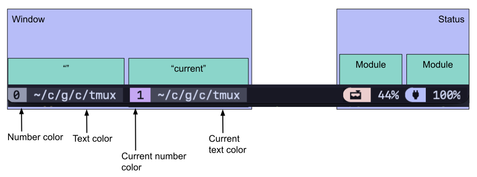
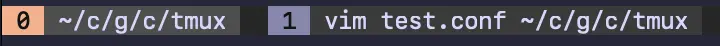
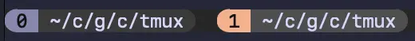
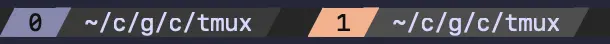
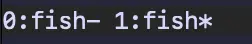

## Configuration Reference



This is a diagram of how the theme is split between its components.

### Top Level Options

| Option               | Effect                                                                         |
| -------------------- | ------------------------------------------------------------------------------ |
| `@gruvbox_flavor` | Sets the gruvbox flavor, one of "latte", "frappe", "macchiato", or "mocha". |

### Status Line

| Option                        | Effect                                        |
| ----------------------------- | --------------------------------------------- |
| @gruvbox_status_background | Sets the background color of the status line. |

- `default` will use the color from the selected theme
- `none` will make the status bar transparent
- use hex color codes for other colors or a theme color (`#{@thm_<color>}`)

### Window

The plugin comes with three window styles built in, these can be customized by
setting the `@gruvbox_window_status_style` option. The default is `basic`.

| Option    | Effect                                                                   | Preview                                                |
| --------- | ------------------------------------------------------------------------ | ------------------------------------------------------ |
| `basic`   | Simple styling with blocks.                                              |            |
| `rounded` | Each window is separated with rounded separators.                        |  |
| `slanted` | Each window is separated with slanted separators.                        |  |
| `custom`  | Custom separators are used. This is required to override the separators! |                                                        |
| `none`    | Styling of the window status is completely disabled.                     |        |

If you want to change the active color to something else (the default is purple),
use the following. For example to use lavender:

```bash
set -g @gruvbox_window_current_number_color "#{@thm_gray}"
```

<details>

<summary>Customising the separators</summary>

Add the following,
setting whatever values you'd like for the separators:

```bash
set -g @gruvbox_window_status_style "custom"
set -g @gruvbox_window_left_separator ""
set -g @gruvbox_window_middle_separator ""
set -g @gruvbox_window_right_separator ""
```

</details>

### Menu

**Set the menu selected style:**

```sh
# Use a value compatible with the standard tmux `menu-selected-style`
set -g @gruvbox_menu_selected_style "fg=#{@thm_surface_0},bg=#{@thm_yellow}"
```

### All options and their defaults

```bash
# Menu styling options
set -ogq @gruvbox_menu_selected_style "fg=#{@thm_fg},bold,bg=#{@thm_overlay_0}"

# Pane styling options
set -ogq @gruvbox_pane_status_enabled "no" # set to "yes" to enable
set -ogq @gruvbox_pane_border_status "off" # set to "yes" to enable
set -ogq @gruvbox_pane_border_style "fg=#{@thm_overlay_0}"
set -ogq @gruvbox_pane_active_border_style "##{?pane_in_mode,fg=#{@thm_gray},##{?pane_synchronized,fg=#{@thm_purple},fg=#{@thm_gray}}}"
set -ogq @gruvbox_pane_left_separator "█"
set -ogq @gruvbox_pane_middle_separator "█"
set -ogq @gruvbox_pane_right_separator "█"
set -ogq @gruvbox_pane_color "#{@thm_green}"
set -ogq @gruvbox_pane_background_color "#{@thm_surface_0}"
set -ogq @gruvbox_pane_default_text "##{b:pane_current_path}"
set -ogq @gruvbox_pane_default_fill "number"
set -ogq @gruvbox_pane_number_position "left" # right, left

set -ogq @gruvbox_window_status_style "basic" # basic, rounded, slanted, custom, or none
set -ogq @gruvbox_window_text_color "#{@thm_surface_0}"
set -ogq @gruvbox_window_number_color "#{@thm_overlay_2}"
set -ogq @gruvbox_window_text " #T"
set -ogq @gruvbox_window_number "#I"
set -ogq @gruvbox_window_current_text_color "#{@thm_surface_1}"
set -ogq @gruvbox_window_current_number_color "#{@thm_purple}"
set -ogq @gruvbox_window_current_text " #T"
set -ogq @gruvbox_window_current_number "#I"
set -ogq @gruvbox_window_number_position "left"
set -ogq @gruvbox_window_flags "none" # none, icon, or text
set -ogq @gruvbox_window_flags_icon_last " 󰖰" # -
set -ogq @gruvbox_window_flags_icon_current " 󰖯" # *
set -ogq @gruvbox_window_flags_icon_zoom " 󰁌" # Z
set -ogq @gruvbox_window_flags_icon_mark " 󰃀" # M
set -ogq @gruvbox_window_flags_icon_silent " 󰂛" # ~
set -ogq @gruvbox_window_flags_icon_activity " 󱅫" # #
set -ogq @gruvbox_window_flags_icon_bell " 󰂞" # !
# Matches icon order when using `#F` (`#!~[*-]MZ`)
set -ogq @gruvbox_window_flags_icon_format "##{?window_activity_flag,#{E:@gruvbox_window_flags_icon_activity},}##{?window_bell_flag,#{E:@gruvbox_window_flags_icon_bell},}##{?window_silence_flag,#{E:@gruvbox_window_flags_icon_silent},}##{?window_active,#{E:@gruvbox_window_flags_icon_current},}##{?window_last_flag,#{E:@gruvbox_window_flags_icon_last},}##{?window_marked_flag,#{E:@gruvbox_window_flags_icon_mark},}##{?window_zoomed_flag,#{E:@gruvbox_window_flags_icon_zoom},} "

# Status line options
set -ogq @gruvbox_status_left_separator ""
set -ogq @gruvbox_status_middle_separator ""
set -ogq @gruvbox_status_right_separator "█"
set -ogq @gruvbox_status_connect_separator "yes" # yes, no
set -ogq @gruvbox_status_fill "icon"
set -ogq @gruvbox_status_module_bg_color "#{@thm_surface_0}"
```
