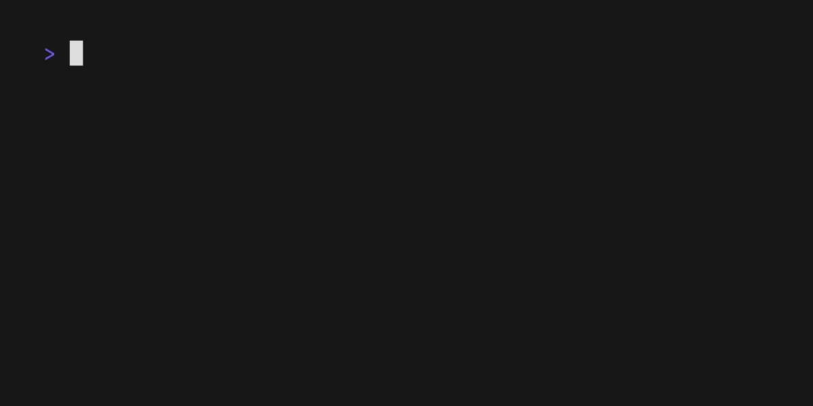

Want to install the color scheme and make tmux pastel? Great! Here's how.

## Step 1: Clone this repository

<!-- x-release-please-start-version -->
```bash
mkdir -p ~/.config/tmux/plugins/catppuccin
git clone -b v2.1.2 https://github.com/catppuccin/tmux.git ~/.config/tmux/plugins/catppuccin/tmux
```
<!-- x-release-please-end -->

## Step 2: Edit your tmux configuration file

Using your favourite editor, edit the file `~/.tmux.conf`.

It should look like this:

```bash
set -g @catppuccin_flavor 'mocha'

run ~/.config/tmux/plugins/catppuccin/tmux/catppuccin.tmux
```

This will load the catppuccin plugin and apply the defaults.
To apply the changes to your configuration file, exit tmux completely
and start it again. You can also run `tmux source ~/.tmux.conf`, but this may
not work as well when changing options.

## Step 3: Customize

The default configuration looks a little bland. Let's change it to
be a bit more colorful. Edit your tmux config again so it looks like this.

```bash
# Pick a softer palette.
set -g @catppuccin_flavor 'frappe'

run ~/.config/tmux/plugins/catppuccin/tmux/catppuccin.tmux

# Make the status line more pleasant.
set -g status-left ""
set -g status-right '#[fg=#{@thm_crust},bg=#{@thm_teal}] session: #S '

# Ensure that everything on the right side of the status line
# is included.
set -g status-right-length 100
```

There is some new stuff here. Firstly, everything is documented in
the "[tmux man page](https://man7.org/linux/man-pages/man1/tmux.1.html)".
Go check it out if anything is unclear. The lines `set -g ...` are setting
"options". The `-g` means that the option is global, so it applies everywhere.
When an option name begins with `@`, then it is a "user" option and has no
effect on tmux itself. This is used to essentially set global variables.

Three options are set that control how tmux looks, `status-left`,
`status-right`, and `status-right-length`. These options are documented
in the man page, but the tl;dr is that they control what appears on the left
and right of the status line.

The `#[]` syntax is an embedded style, similar to inline css.
`fg=#{@thm_crust}` says "make the text the crust color". `@thm_crust` is a
user option set by the plugin. It is created by the line
`run ~/.config/tmux/plugins/catppuccin/tmux/catppuccin.tmux`, so if you try
and use colors before that line, it won't work. The `#S` is a special sequence
that tmux replaces with the current session name. There are a long, long
"[list of special sequences](https://man7.org/linux/man-pages/man1/tmux.1.html#FORMATS)"
that tmux can replace.

If everything is working right, your version should look like this:


