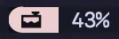

# User Defined Status Line Modules

To create your own status line module that uses the gruvbox theme,
all you need to do is add it to the `status-left` or `status-right` options.

You can add arbitrary things to the status line like so:

```sh
# ~/.tmux.conf

set -agF status-right "#[fg=#{@thm_crust},bg=#{@thm_teal}] ##H "
```

This will append the current hostname (`#H`) to the status line with a teal
background and dark black text.

You can also use icons for styling, for example to show the used memory percentage
on MacOS:

```sh  
set -g status-right "#[bg=#{@thm_red_two},fg=#{@thm_crust}]#[reverse]#[noreverse]󱀙  "
set -ag status-right "#[fg=#{@thm_fg},bg=#{@thm_mantle}] #(memory_pressure | awk '/percentage/{print $5}') "
```



To use the status module formatting that gruvbox uses, do the following:

```sh
# In ~/.tmux.conf, after the gruvbox plugin has been loaded.

%hidden MODULE_NAME="my_custom_module"

set -ogq "@gruvbox_${MODULE_NAME}_icon" " "
set -ogqF "@gruvbox_${MODULE_NAME}_color" "#{E:@thm_purple_two}"
set -ogq "@gruvbox_${MODULE_NAME}_text" "#{pane_current_command}"

source "<path to gruvbox plugin>/utils/status_module.conf"

set -g status-right "#{E:@gruvbox_status_application}#{E:@gruvbox_status_my_custom_module}"
```
