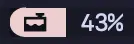

# User Defined Status Line Modules

To create your own status line module that uses the catppuccin theme,
all you need to do is add it to the `status-left` or `status-right` options.

You can add arbitrary things to the status line like so:

```sh
# ~/.tmux.conf

set -agF status-right "#[fg=#{@thm_crust},bg=#{@thm_teal}] ##H "
```

This will append the current hostname (`#H`) to the status line with a teal
background and dark black text.

You can also use icons for styling, for example to show the used memory percentage
on MacOS:

```sh  
set -g status-right "#[bg=#{@thm_flamingo},fg=#{@thm_crust}]#[reverse]#[noreverse]󱀙  "
set -ag status-right "#[fg=#{@thm_fg},bg=#{@thm_mantle}] #(memory_pressure | awk '/percentage/{print $5}') "
```



To use the status module formatting that catppuccin uses, do the following:

```sh
# In ~/.tmux.conf, before the catppuccin plugin has been loaded.

%hidden MODULE_NAME="my_custom_module"

set -g "@catppuccin_${MODULE_NAME}_icon" " "
set -gF "@catppuccin_${MODULE_NAME}_color" "#{E:@thm_pink}"
set -g "@catppuccin_${MODULE_NAME}_text" "#{pane_current_command}"

source "<path to catppuccin plugin>/utils/status_module.conf"

set -g status-right "#{E:@catppuccin_status_application}#{E:@catppuccin_status_my_custom_module}"
```

## Pane Synchronization Indicator

Show a styled indicator on the status line when tmux panes are synchronized.
The badge appears only when panes are synced and disappears otherwise.

Uses the `pane_synchronized` tmux format variable with a conditional to toggle
visibility, colored with catppuccin mauve.

```sh
# ~/.tmux.conf — after catppuccin is loaded

# Pre-define the sync badge format in a variable to avoid
# nesting #[...] style directives inside #{?...} conditionals
set -g @sync_on '#[fg=#{@thm_mauve}] 󰓦 SYNC '

# Include the conditional in status-left (or status-right)
set -g status-left "#{?pane_synchronized,#{@sync_on},}#{E:@catppuccin_status_session} #{E:@catppuccin_status_directory}"
```

| Setting | Value | Description |
|---------|-------|-------------|
| Icon | `󰓦` | nf-md-sync (Nerd Font) |
| Color | `#{@thm_mauve}` | Catppuccin mauve (`#c6a0f6` in Macchiato) |
| Visibility | `#{?pane_synchronized,...}` | Only shown when panes are synced via `prefix a` |

**How it works:** tmux evaluates `status-left` on every status-interval tick.
When panes are synchronized, `#{?pane_synchronized,...}` expands the `@sync_on`
variable which contains the mauve-colored icon and text. When unsynced, the
false-branch is empty and no badge appears.
